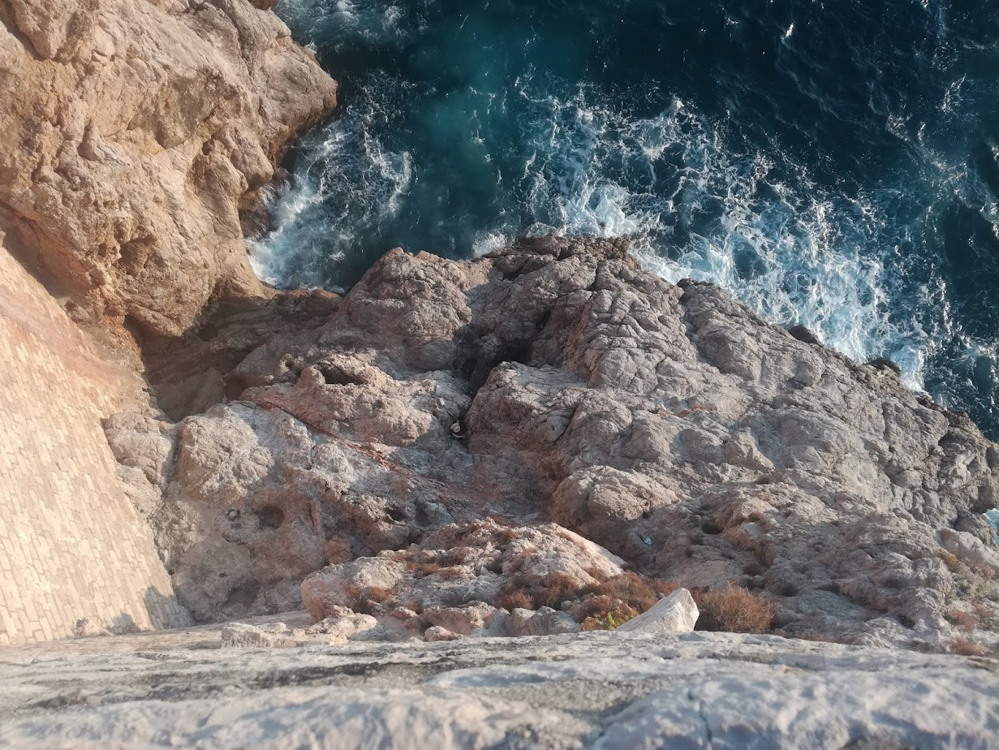
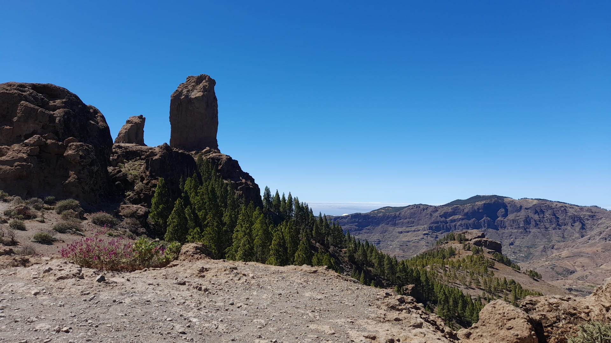
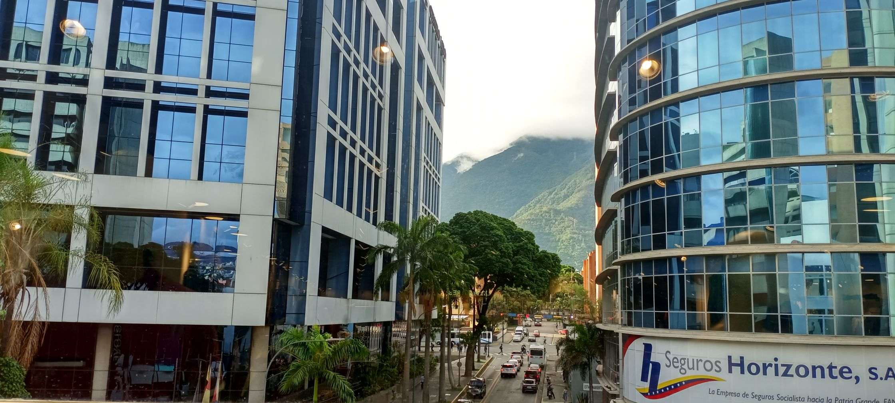
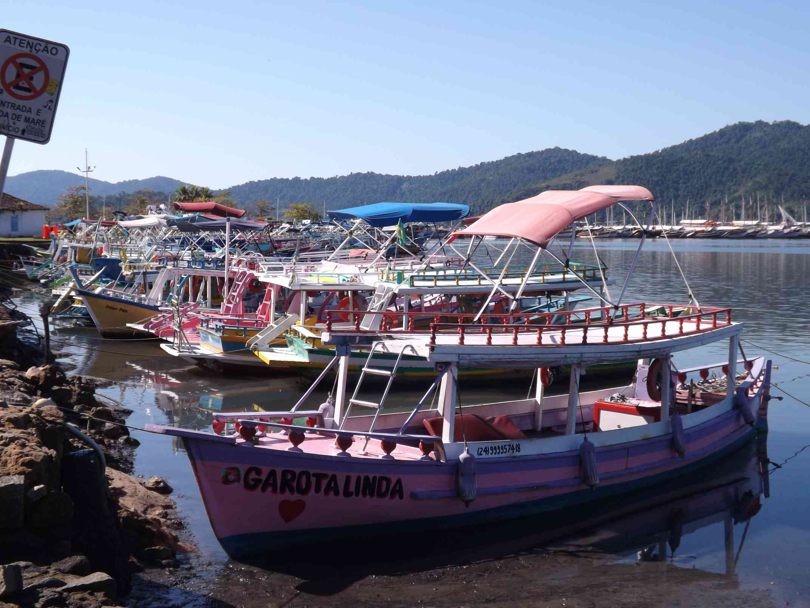

# Mr. Worldwide (100 points)

For this task we were given 5 images, and we had to find the country in which the image was taken.
The images were:

1. 
2. 
3. 
4. 
5. 

We couldn't reverse image search the first image, but it looked like Croatia,
so we guessed Croatia.

The second image was easy to reverse image search and it was Spain.

The third image was also easy to reverse image search and it was Jamaica.

The fourth image was taken in Venezuela.

And the fifth image was taken in Brazil.

To get the flag we had to find the country codes of the countries in which the
images were taken and concatenate them in the order in which the images were given.

So the flag is CTF2024[3853418765855]